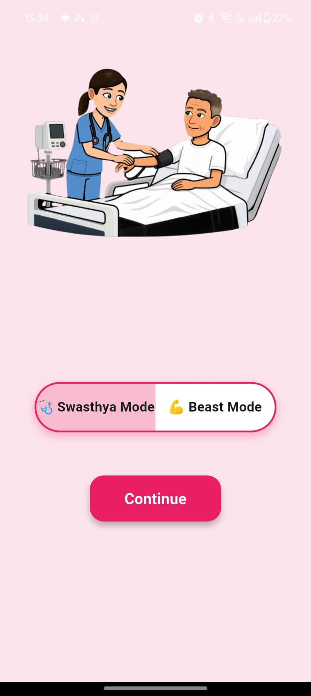
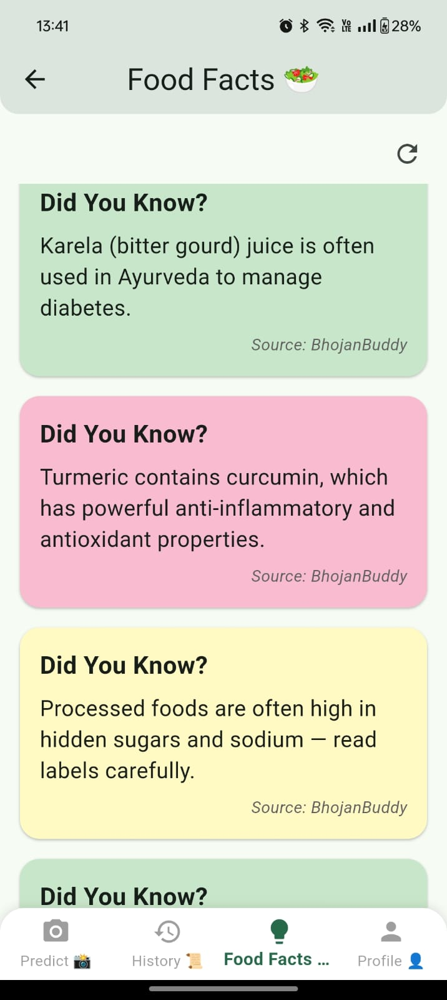

# BhojanBuddy

A food tracking application with BMI calculation and food recognition features.


---

## 📱 App Screenshots

| Login Screen              | History Screen            | Food Scan                |
|:------------------------:|:------------------------:|:-----------------------:|
|  |  |  |

---

## 🖼 More App Images

|  |  |  |
|:----------------------:|:---------------------:|:---------------------:|
|   |  |  |
|   |                       |                       |

---

## 🚀 Setup Instructions

### Backend Setup

1. Make sure you have Python 3.8+ installed
2. Install the required dependencies:
   ```
   pip install -r requirements.txt
   ```
3. Run the server:
   ```
   python run_server.py
   ```
4. The server will display the IP address and port it's running on. Note this information for configuring the mobile app.

### Frontend Setup

1. Make sure you have Flutter installed
2. Install the required dependencies:
   ```
   cd frontend
   flutter pub get
   ```
3. Run the app:
   ```
   flutter run
   ```

---

## 🔗 Connecting Mobile App to Backend

When running the app on a physical device:

1. Make sure your phone and computer are on the same network
2. Launch the app
3. Tap the settings icon in the top-right corner of the login screen
4. Enter the server URL displayed when you ran `run_server.py` (e.g., `http://192.168.1.100:5000`)
5. Tap "Save and Test Connection"

When running on an emulator:

- Use `http://10.0.2.2:5000` as the server URL (this is the special IP that allows the emulator to connect to the host machine's localhost)

---

## 🛠 Troubleshooting

If you encounter connection issues:

1. Make sure your phone and computer are on the same network
2. Check if any firewall is blocking the connection
3. Try disabling the firewall temporarily for testing
4. Ensure the backend server is running with `host=0.0.0.0` to accept external connections
5. Check the server logs for any error messages

---

## 📄 License

Add your license information here.